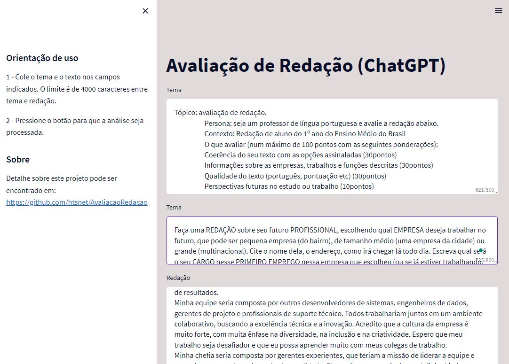

Project: Project in Python using ChatGPT for text processing, using Streamlit for the visual part.
Autor: Hamilton Tenório da Silva
Date: april/19/2023

See this project on https://htsnet-avaliacaoredacao-app-4vysvn.streamlit.app/   

------ Instructions ------
pip install virtualenv
python -m venv Ambiente_Virtual
cd Ambiente_Virtual\Scripts
activate
cd ../..
pip install <packages>
streamlit run app.py